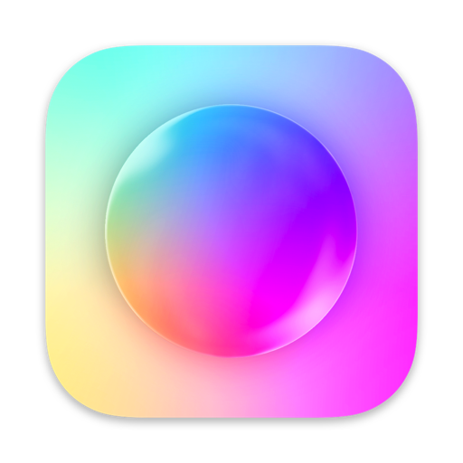
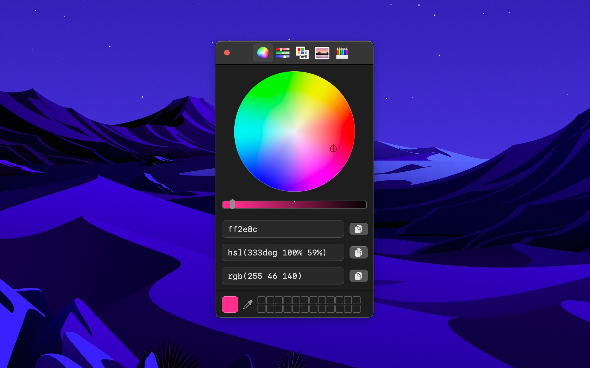
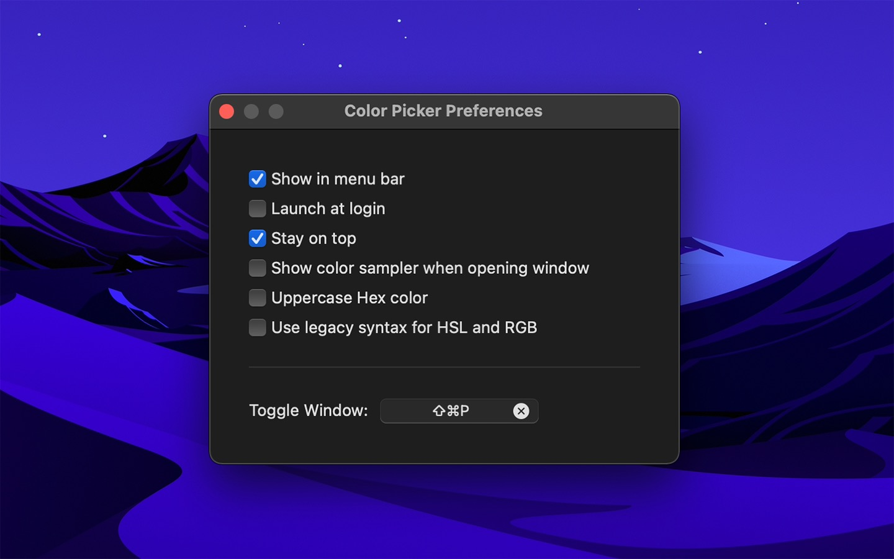

	
	<h1>System Color Picker</h1>
	

		<b>The macOS color picker as an app with more features</b>
	

	 
	 
	 

## Download

Requires macOS 11 or later.

## Features

- Quickly copy, paste, and convert colors in Hex, HSL, RGB, LCH format
- Show as a normal app or in the menu bar
- Pick a color or toggle the window from anywhere with a global keyboard shortcut
- Make the window stay on top of all other windows
- Launch it at login

## Keyboard shortcuts

You can use the following keyboard shortcuts in the app:

- Pick color: <kbd>Command</kbd> <kbd>p</kbd>
- Copy as Hex: <kbd>Shift</kbd> <kbd>Command</kbd> <kbd>h</kbd>
- Copy as HSL: <kbd>Shift</kbd> <kbd>Command</kbd> <kbd>s</kbd>
- Copy as RGB: <kbd>Shift</kbd> <kbd>Command</kbd> <kbd>r</kbd>
- Copy as LCH: <kbd>Shift</kbd> <kbd>Command</kbd> <kbd>l</kbd>
- Paste color: <kbd>Shift</kbd> <kbd>Command</kbd> <kbd>v</kbd> *(In the format Hex, HSL, RGB, or LCH)*

## Plugins

The built-in color picker supports plugins:

- [Scala Color](https://bjango.com/mac/skalacolor/)
- [Pro Picker](https://formulae.brew.sh/cask/colorpicker-propicker)
- [Material Design](https://github.com/johnyanarella/MaterialDesignColorPicker)
- [Color Picker Plus](https://github.com/viktorstrate/color-picker-plus)

## Screenshots

## FAQ

#### What is LCH color?

[It's a more human-friendly color format.](https://lea.verou.me/2020/04/lch-colors-in-css-what-why-and-how/)

Note that the LCH color is [currently clamped to sRGB range](https://github.com/sindresorhus/System-Color-Picker/issues/13).

#### The color changes if I copy and then paste it

That is because the default color space in the picker is [Display P3](https://en.wikipedia.org/wiki/DCI-P3), which is [part of CSS Color 4](https://drafts.csswg.org/css-color-4/#valdef-color-display-p3), but the color space used for the legacy CSS color formats is [sRGB](https://en.wikipedia.org/wiki/SRGB) (browsers are starting to [handle color spaces](https://css-tricks.com/the-expanding-gamut-of-color-on-the-web/) but they are not all there yet).

#### How do I change the color space?

Right-click the color wheel. You probably want to select “sRGB”.

Note that the color strings will always be converted to [sRGB](https://en.wikipedia.org/wiki/SRGB) color space.

#### Can you support `SwiftUI.Color` / `UIColor` / `NSColor` formats?

The best practice is to use [Asset Catalog for colors](https://devblog.xero.com/managing-ui-colours-with-ios-11-asset-catalogs-16500ba48205) instead of hard-coding the values in code. If you really want to hard-code colors, the [Scala color picker plugin](https://bjango.com/mac/skalacolor/) supports `UIColor` and `NSColor`.

#### Can I contribute localizations?

I don't have any immediate plans to localize the app.

## Built with

- [Defaults](https://github.com/sindresorhus/Defaults) - Swifty and modern UserDefaults
- [Regex](https://github.com/sindresorhus/Regex) - Swifty regular expressions
- [KeyboardShortcuts](https://github.com/sindresorhus/KeyboardShortcuts) - Add user-customizable global keyboard shortcuts to your macOS app
- [LaunchAtLogin](https://github.com/sindresorhus/LaunchAtLogin) - Add “Launch at Login” functionality to your macOS app

## Other apps

- [Gifski](https://github.com/sindresorhus/Gifski) - Convert videos to high-quality GIFs
- [Plash](https://github.com/sindresorhus/Plash) - Make any website your Mac desktop wallpaper
- [More apps…](https://sindresorhus.com/apps)
